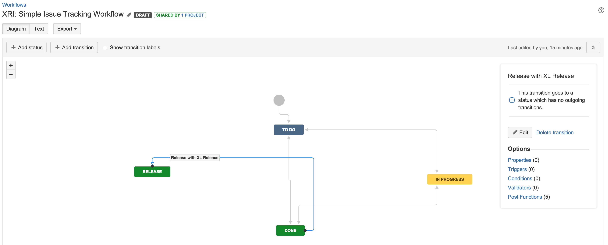
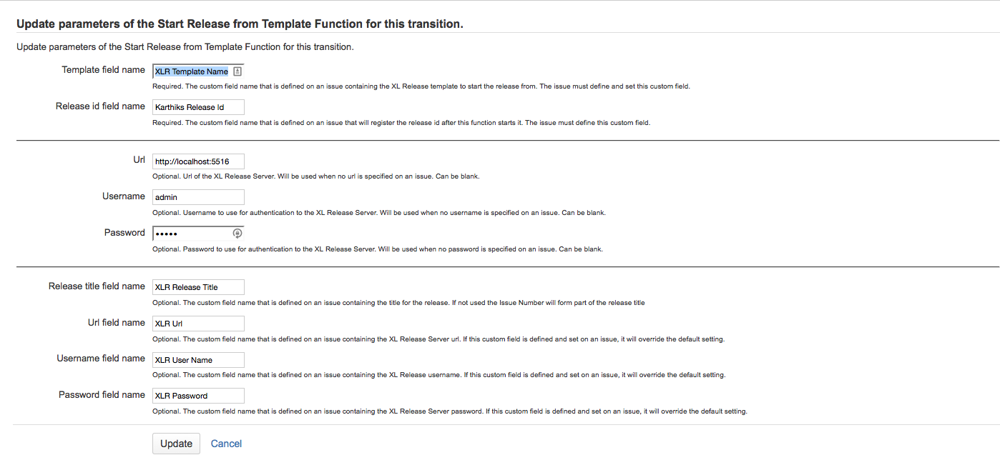
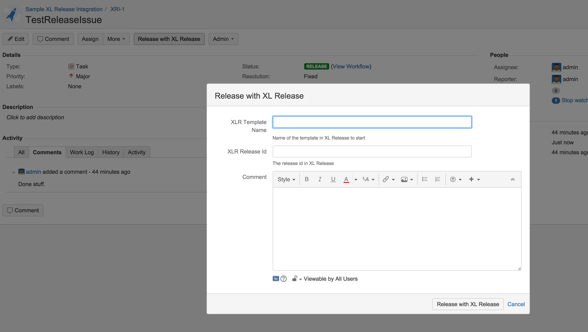
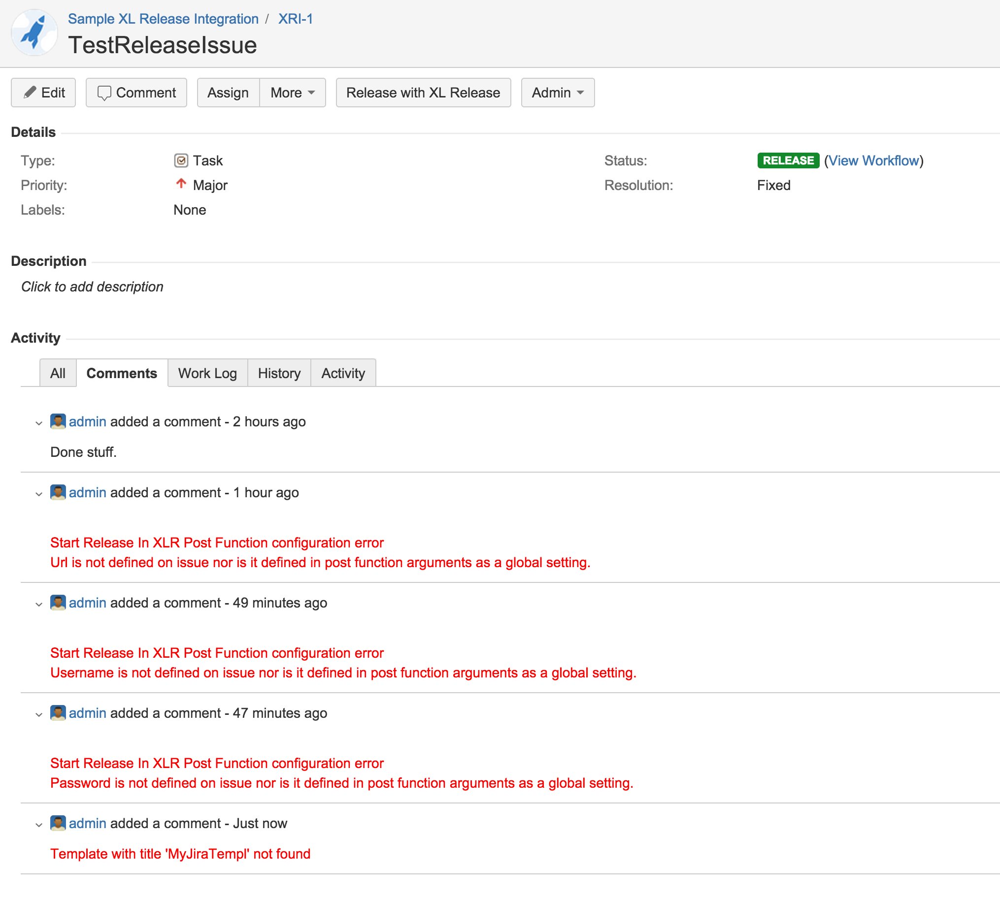

# XL Release addon for Jira

## Preface ##

This document describes the functionality provided by the XL Release addon for Jira.

As a prerequisite, the reader should have a good understanding of administering Jira Work Flows, Screens and Custom Fields. For more information, please refer to :

* [Jira Administration Guide](https://confluence.atlassian.com/display/JIRA/JIRA+Administrator's+Guide)
* Jira Administration Tutorial Videos
	* [Jira Workflows](https://www.youtube.com/watch?v=XCXec_F0Z_8)
	* [Setting up Fields and Screens](https://www.youtube.com/watch?v=SOIjfMxS6HE)

If you wish to extend the plugin, the following will be useful :

* [Atlassian's Getting Started](https://developer.atlassian.com/docs/getting-started) 
* [Set up the Atlassian Plugin SDK and Build a Project](https://developer.atlassian.com/docs/getting-started/set-up-the-atlassian-plugin-sdk-and-build-a-project)
* The sdk requires an Oracle ojdbc driver in the local maven repository. After downloading the [ojdbc6.jar](http://www.oracle.com/technetwork/apps-tech/jdbc-112010-090769.html) file, you can run the following maven command to install it `atlas-mvn install:install-file -Dfile=path/to/ojdbc6-11.2.0.2.0.jar -DgroupId=com.oracle -DartifactId=ojdbc6 -Dversion=11.2.0.2.0 -Dpackaging=jar`
* To run the plugin in a development Jira instance, execute `atlas-run` from the checked out projects root directory.

## Overview ##

The XL Release addon for Jira is a Jira plugin with a primary focus of starting releases in XL Release triggered from Jira work flows. The plugin provides a transition post function for this purpose.

## Features ##

* _Start release from template_ Post Function
	* Global XL Release Server authentication
	* Per issue XL Release Server authentication
	* Per issue XL Release template
	* Matches custom fields on an issue to like named XL Release template variables
	* Passes issue number to XL Release template variable called _issue_
* XL Release Password Field
	* Custom field type that hides the password on input and display
	 	
## Requirements ##

* **XL Release** 4.6+
* **Jira** 6.3.x, 6.4.x
		

## Installation ##

The addon can be downloaded directly from the plugin's repository on [Github](https://github.com/xebialabs-community/xlr-addon-for-jira/releases).

Please follow the instructions detailed in the _"Installing by file upload"_ section of Atlassian's [Universal Plugin Mananager](https://confluence.atlassian.com/display/UPM/Installing+add-ons) documentation.

## _Start release from template_ Post Function ##

The post function can be used in a work flow transition provided it happens after the Issue has actually been created (i.e if adding to the **Create** flow transition ensure it is the final step). 

The function uses predefined custom fields on an issue for input and output. At bare minimum, 2 custom fields are required,

* A field to indicate the release template to start in XL Release 
* A field to capture the XL Release id after a successful start

Other optional input custom fields are,

* A field to indicate the XL Release Server url
* A field to indicate the username to use for authentication in XL Release Server
* A field to indicate the password to use for authentication in XL Release Server
* A field to indicate the release title to use

Any other custom field on an issue is used as input to XL Release template variables. The association is made based on the field name. The issue number is mapped to an XL Release template variable called _issue_ if present.

The name of the custom fields can be customized via the function's parameter settings.

Any errors encountered are logged as comments on the issue.

### Settings ###

| Parameter | Description | Required | Default |
| --------- | ----------- | -------- | ------- |
| Template Field Name | The custom field name that is defined on an issue containing the XL Release template to start the release from. The issue must define and set this custom field.| Yes | XLR Template Name |
|Release id field name| The custom field name that is defined on an issue that will register the release id after this function starts it. The issue must define this custom field. | Yes |XLR Release Id |
| Url | Url of the XL Release Server. Will be used when no url is specified on an issue. Can be blank. | No | http://localhost:5516 |
| Username | Username to use for authentication to the XL Release Server. Will be used when no username is specified on an issue. Can be blank. | No | admin |
| Password | Password to use for authentication to the XL Release Server. Will be used when no password is specified on an issue. Can be blank. | No | admin |
| Release title field name | The custom field name that is defined on an issue containing the title for the release. Does not have to be defined on issue, will be automatically generated for issue number. | No | XLR Release Title |
| Url field name | The custom field name that is defined on an issue containing the XL Release Server url. If this custom field is defined and set on an issue, it will override the default setting. | No | XLR Url |
| Password field name | The custom field name that is defined on an issue containing the XL Release username. If this custom field is defined and set on an issue, it will override the default setting.| No | XLR Password |

## XL Release Password Field ##

Unfortunately, Jira does not have a password custom field type. This plugin introduces such a type that hides the password on input and display.

## Screenshots samples ##

The following screenshots are samples from a potential integration scenario.

## Workflow ##

Sample workflow that introduces a _Release_ status. A user will transition to this state from the _Done_ status.

## Post Function Selection ##

## Post Function Configuration ##

## Release screen ##

Sample custom release screen that is associated with the workflow transition.

## Error comments ##

Sample error messages logged by the post function to the issue's comments.

## Successful start of release comment ##

